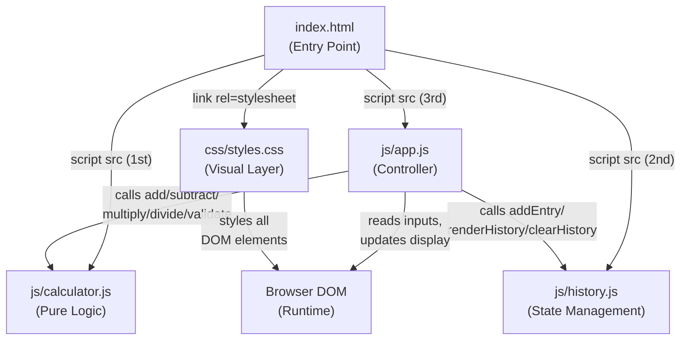
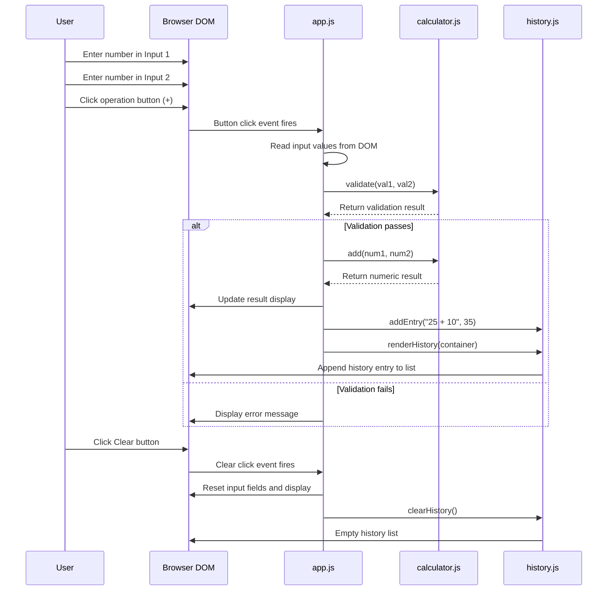

# Technical Specification

# 0. Agent Action Plan

## 0.1 Intent Clarification

### 0.1.1 Core Feature Objective

Based on the prompt, the Blitzy platform understands that the new feature requirement is to **create a complete, standalone calculator web application from scratch** in a currently empty repository (containing only a placeholder `README.md`). The application must accept two numeric inputs from the user, allow selection of a basic arithmetic operation, and display the computed result — all within a clean, browser-based interface.

The specific feature requirements are:

- **Dual Numeric Input**: The application must provide two dedicated input fields where users enter numeric values (e.g., 25 and 10)
- **Operation Selection**: The user must be able to select one of four arithmetic operations via dedicated buttons: Addition (`+`), Subtraction (`-`), Multiplication (`*`), Division (`/`)
- **Result Display**: After an operation is performed, the result must appear in a clearly visible display area within the interface
- **Clear/Reset Capability**: A "Clear" button must reset both input fields and the result display to their initial empty/default state
- **Continuous Usage**: The user must be able to perform multiple sequential calculations without restarting the application or refreshing the page
- **Error Handling**: The application must gracefully handle three edge-case scenarios with specific user-facing messages:
  - Division by zero → display "Cannot divide by zero"
  - Empty input fields → display "Please enter both numbers"
  - Non-numeric input → display "Invalid input, please enter numbers only"

Additionally, the following **bonus features** are identified as optional enhancements:

- **Calculation History Log**: Maintain and display a running log of past calculations and their results
- **Keyboard Support**: Allow users to enter numbers and trigger operations via keyboard input (not just mouse clicks)
- **Dark Mode / Light Mode Toggle**: Provide a visual theme switcher between light and dark color schemes

### 0.1.2 Special Instructions and Constraints

- **Tech Stack Selection**: The user presented three tech stack options — Web (HTML + CSS + JavaScript), Python (CLI/Tkinter), and Mobile (React Native/Flutter) — with the directive to "choose one." The Blitzy platform selects **Web: HTML + CSS + JavaScript** as the implementation technology because:
  - It directly satisfies all stated UI requirements (input fields, buttons, display area, clear button) without external dependencies
  - It enables a zero-build, zero-install runtime — the application runs in any modern browser
  - It is the first and most lightweight option listed, ideal for the "clean and simple interface" requirement
  - It supports all bonus features (keyboard events, CSS theme toggling, DOM-based history list) natively
- **Greenfield Repository**: The repository contains only `README.md` with the content `# 18feb_4`. All application files must be created from scratch with no existing code to integrate against or extend
- **No Backend Requirement**: The calculator is a purely client-side application — all computation occurs in the browser with no server, API, or database dependency
- **Exact Error Messages**: The user specified precise error message strings that must be used verbatim:
  - `"Cannot divide by zero"`
  - `"Please enter both numbers"`
  - `"Invalid input, please enter numbers only"`
- **User Example** (preserved exactly as provided):
  ```
  Input 1:  25
  Input 2:  10
  Operation: +
  Result:   35
  ```

### 0.1.3 Technical Interpretation

These feature requirements translate to the following technical implementation strategy:

- To **provide dual numeric input**, we will create an `index.html` file with two `<input>` elements of type `text` (using `text` rather than `number` to enable custom validation messaging for non-numeric entries)
- To **enable operation selection**, we will create four `<button>` elements in `index.html` bound to click event handlers in `js/calculator.js` that invoke the corresponding arithmetic function
- To **display results**, we will create a dedicated `<div>` display area in `index.html` whose `textContent` is updated programmatically via DOM manipulation in `js/app.js`
- To **implement clear/reset**, we will create a "Clear" `<button>` in `index.html` with an event handler in `js/app.js` that resets input field values and the result display to empty strings
- To **support continuous usage**, we will structure event handlers so they read current input values on each operation click, allowing repeated calculations without page refresh
- To **handle edge cases**, we will implement a `validate()` function in `js/calculator.js` that checks for empty strings and non-numeric values (using `isNaN()` and string trimming) before performing any arithmetic, and a division guard that returns the specified error string when the divisor is zero
- To **implement calculation history** (bonus), we will create `js/history.js` with an array-based history store and a function that appends formatted entries (`"25 + 10 = 35"`) to an `<ul>` element in the DOM
- To **support keyboard input** (bonus), we will add a `keydown` event listener in `js/app.js` that maps `Enter` to the last-used or default operation and `Escape` to the clear action
- To **toggle dark/light mode** (bonus), we will define CSS custom properties in `css/styles.css` under `:root` and `[data-theme="dark"]` selectors, with a toggle button in `index.html` that switches the `data-theme` attribute on the `<html>` element via `js/app.js`


## 0.2 Repository Scope Discovery

### 0.2.1 Comprehensive File Analysis

#### Current Repository State

The repository is a **greenfield project** containing a single file. A complete traversal of the repository root confirms:

| Path | Type | Status | Content |
|------|------|--------|---------|
| `README.md` | File | EXISTS — TO BE MODIFIED | Contains only the heading `# 18feb_4`; must be replaced with full project documentation |

No other files, folders, configuration manifests, dependency lock files, build scripts, or source code exist in the repository. There are no `.gitignore`, `package.json`, `requirements.txt`, or any other standard project scaffold files present.

#### Existing Files to Modify

| File Path | Current Purpose | Modification Required |
|-----------|----------------|----------------------|
| `README.md` | Placeholder project identifier | Replace content with comprehensive calculator application documentation including usage instructions, project structure, feature descriptions, and setup/run instructions |

#### New Source Files to Create

| File Path | Purpose | Description |
|-----------|---------|-------------|
| `index.html` | Main application entry point | HTML document defining the calculator UI structure — input fields, operation buttons, result display area, clear button, history panel, and theme toggle |
| `css/styles.css` | Application styling | Complete stylesheet with CSS custom properties for theming, responsive layout, input/button styling, result display formatting, history panel styling, and dark/light mode definitions |
| `js/calculator.js` | Core computation logic | Pure calculation functions (`add`, `subtract`, `multiply`, `divide`), input validation (`validate`), and error handling logic — no DOM dependencies for testability |
| `js/app.js` | Application initialization and UI binding | DOM event listeners for operation buttons, clear button, keyboard shortcuts, and theme toggle; bridges UI interactions to `calculator.js` functions and updates the display |
| `js/history.js` | Calculation history management | Array-based history store with `addEntry()`, `clearHistory()`, and `renderHistory()` functions to maintain and display the calculation log in the DOM |

#### New Test Files to Create

| File Path | Purpose | Description |
|-----------|---------|-------------|
| `tests/calculator.test.html` | Unit test runner page | HTML page that loads `calculator.js` and a lightweight test harness to execute unit tests in the browser |
| `tests/calculator.test.js` | Calculator logic unit tests | Test cases covering all four arithmetic operations, division-by-zero handling, empty input validation, non-numeric input validation, and boundary conditions |
| `tests/history.test.js` | History module unit tests | Test cases for history entry creation, history clearing, and history rendering correctness |

#### New Configuration and Documentation Files to Create

| File Path | Purpose | Description |
|-----------|---------|-------------|
| `.gitignore` | Git ignore patterns | Exclude OS-generated files (`.DS_Store`, `Thumbs.db`), editor artifacts (`.vscode/`, `.idea/`), and any temporary files |
| `LICENSE` | License file | Project license declaration |

### 0.2.2 Web Search Research Conducted

The following research topics were evaluated for implementation best practices:

- **Vanilla JavaScript calculator patterns**: Standard approaches for building calculator UIs without frameworks confirm that event delegation on a button container, combined with `parseFloat()` for numeric conversion and `isNaN()` for validation, are the industry-standard patterns for client-side calculators
- **CSS custom properties for theming**: Using `:root` and `[data-theme="dark"]` selectors with CSS custom properties (`--color-bg`, `--color-text`, etc.) is the modern, framework-free approach to implementing dark/light mode toggles without JavaScript class name management
- **Keyboard event handling in web calculators**: Best practice is to use a single `document.addEventListener('keydown', handler)` with key matching for digits, operators (`+`, `-`, `*`, `/`), `Enter` (compute), and `Escape` (clear)
- **Client-side testing without npm**: Lightweight assertion-based test harnesses that run directly in the browser (no build step) are appropriate for pure HTML/CSS/JS projects, using simple assertion functions and DOM-based test result display

### 0.2.3 New File Requirements

#### Source Files — Complete Inventory

- `index.html` — Main HTML document serving as the single-page application entry point; defines the full calculator UI structure including semantic HTML5 elements
- `css/styles.css` — All visual styling including layout grid, color themes (light/dark), button states (hover, active, focus), input field styling, result display formatting, history panel layout, and responsive breakpoints
- `js/calculator.js` — Pure computational module exporting: `add(a, b)`, `subtract(a, b)`, `multiply(a, b)`, `divide(a, b)`, and `validate(input1, input2)` — designed with no DOM coupling for direct testability
- `js/app.js` — Application controller responsible for: DOM element selection, event listener registration for all buttons and keyboard input, calling `calculator.js` functions, updating the result display, delegating to `history.js` for logging, and handling theme toggle state
- `js/history.js` — History management module providing: `addEntry(expression, result)`, `getHistory()`, `clearHistory()`, and `renderHistory(containerElement)` — maintains an in-memory array and renders entries to the DOM

#### Test Files

- `tests/calculator.test.html` — Browser-based test runner that loads test scripts and displays pass/fail results
- `tests/calculator.test.js` — Comprehensive test suite for `calculator.js` covering: addition, subtraction, multiplication, division, division by zero, empty input detection, non-numeric input detection, negative numbers, decimal numbers, and large number handling
- `tests/history.test.js` — Test suite for `history.js` covering: adding entries, retrieving history, clearing history, and rendering to a mock container

#### Configuration Files

- `.gitignore` — Standard web project ignore patterns
- `README.md` — Full project documentation (modification of existing file)


## 0.3 Dependency Inventory

### 0.3.1 Private and Public Packages

This calculator application is implemented using **vanilla HTML, CSS, and JavaScript** with zero external dependencies. No package manager (`npm`, `yarn`, `pip`, etc.) is required, and no third-party libraries are consumed at runtime or build time. All functionality — arithmetic computation, input validation, DOM manipulation, event handling, theming, and history management — is implemented using native Web APIs available in all modern browsers.

| Package Registry | Package Name | Version | Purpose | Status |
|-----------------|--------------|---------|---------|--------|
| N/A (Native) | HTML5 | Living Standard | Document structure, semantic elements, input fields | Built into all modern browsers |
| N/A (Native) | CSS3 | Living Standard | Styling, CSS custom properties for theming, Flexbox/Grid layout | Built into all modern browsers |
| N/A (Native) | ECMAScript (ES6+) | ES2015+ | Application logic, DOM manipulation, event handling | Built into all modern browsers |

**Rationale for zero-dependency approach**:
- The calculator's functional requirements (arithmetic operations, input validation, DOM updates) are fully satisfied by native browser APIs
- No build pipeline, bundler, transpiler, or minifier is necessary — reducing complexity to zero for this project scope
- The application loads and executes directly from HTML/CSS/JS files with no compilation step
- This approach aligns with the user's stated preference for a "clean and simple" application

### 0.3.2 Dependency Updates

Since this is a greenfield project with no existing dependencies, there are no dependency updates, import transformations, or version migrations required.

#### Import Structure (New Files Only)

The JavaScript modules follow a script-tag loading pattern in `index.html` rather than ES module imports, ensuring maximum browser compatibility without a bundler:

```html
<script src="js/calculator.js"></script>
<script src="js/history.js"></script>
<script src="js/app.js"></script>
```

**Load order is significant**: `calculator.js` (core logic, no dependencies) must load before `app.js` (depends on `calculator.js` functions), and `history.js` (history module) must load before `app.js` (which calls history functions).

#### External Reference Updates

No external references, configuration files, build files, or CI/CD pipelines exist in the repository that require updating. The following files are created net-new:

| File Category | File Path | Dependency-Related Content |
|--------------|-----------|---------------------------|
| Application Entry | `index.html` | `<script>` tags referencing local JS files; `<link>` tag referencing local CSS |
| Configuration | `.gitignore` | Standard ignore patterns for web projects — no package-manager artifacts to exclude |
| Documentation | `README.md` | No dependency installation instructions needed (zero dependencies) |

### 0.3.3 Browser Compatibility Requirements

Although no external packages are used, the application relies on the following native browser features that define implicit runtime requirements:

| Browser Feature | Used For | Minimum Browser Support |
|----------------|----------|------------------------|
| CSS Custom Properties (`--var`) | Dark/light mode theming | Chrome 49+, Firefox 31+, Safari 9.1+, Edge 15+ |
| `document.querySelector()` | DOM element selection | All modern browsers (ES5+) |
| `addEventListener()` | Event binding for buttons and keyboard | All modern browsers (ES5+) |
| `parseFloat()` / `isNaN()` | Numeric conversion and validation | All browsers (ES3+) |
| `dataset` / `data-*` attributes | Theme attribute toggling | Chrome 8+, Firefox 6+, Safari 5.1+, Edge 12+ |
| Template literals | String formatting for history entries | Chrome 41+, Firefox 34+, Safari 9+, Edge 12+ |
| `Array.prototype.map()` / `forEach()` | History array iteration | All modern browsers (ES5+) |


## 0.4 Integration Analysis

### 0.4.1 Existing Code Touchpoints

Since the repository is a greenfield project with only a placeholder `README.md`, there are **no existing code touchpoints** to modify, extend, or integrate against. The single modification target is:

| File | Modification Type | Details |
|------|-------------------|---------|
| `README.md` | Content replacement | Replace the placeholder heading `# 18feb_4` with full project documentation — project title, description, features, usage instructions, project structure, and browser compatibility notes |

There are no:
- Existing API endpoints to connect to
- Database models or migrations to update
- Service classes requiring extension
- Controllers or handlers to modify
- Middleware or interceptors to consider
- Build pipelines to integrate with
- Authentication or authorization systems to hook into
- Configuration management systems to update

### 0.4.2 Internal Module Integration

The calculator application's three JavaScript modules integrate through a simple dependency chain within the browser's single-threaded execution model:



**Integration contracts between modules**:

| Source Module | Target Module | Integration Point | Contract |
|--------------|--------------|-------------------|----------|
| `js/app.js` | `js/calculator.js` | Function calls | `app.js` invokes `add(a, b)`, `subtract(a, b)`, `multiply(a, b)`, `divide(a, b)`, and `validate(val1, val2)` — all functions return either a numeric result or a string error message |
| `js/app.js` | `js/history.js` | Function calls | `app.js` invokes `addEntry(expression, result)` after each successful calculation, `renderHistory(container)` to refresh the display, and `clearHistory()` when the user clears |
| `js/app.js` | Browser DOM | DOM API | `app.js` uses `document.querySelector()` to select elements by ID/class, reads `.value` from input fields, and writes `.textContent` to the result display and theme toggle button |
| `index.html` | All JS modules | Script loading | `<script>` tags load modules in dependency order; all functions are defined in the global scope |
| `index.html` | `css/styles.css` | Stylesheet link | `<link>` tag loads the stylesheet; CSS selectors target element IDs and classes defined in the HTML |

### 0.4.3 User Interaction Flow

The following diagram illustrates the complete user interaction flow through the integrated modules:



### 0.4.4 External Integration Points

This application has **no external integration points**. It is a fully self-contained, client-side web application:

| Integration Category | Status | Notes |
|---------------------|--------|-------|
| Backend API | Not applicable | All computation is client-side |
| Database | Not applicable | History is stored in-memory (browser session only) |
| Authentication | Not applicable | No user accounts or access control |
| Third-party services | Not applicable | No external API calls |
| CDN / Asset hosting | Not applicable | All assets are local files |
| Analytics / Telemetry | Not applicable | No tracking or monitoring |

The application operates entirely within a single browser tab, with all state (input values, current result, calculation history, theme preference) maintained in JavaScript memory and the DOM. Refreshing the page resets all state to initial defaults.


## 0.5 Technical Implementation

### 0.5.1 File-by-File Execution Plan

Every file listed below MUST be created or modified as specified. Files are grouped by functional role and listed in implementation dependency order.

#### Group 1 — Core Application Files

| Action | File Path | Purpose |
|--------|-----------|---------|
| CREATE | `index.html` | Build the main HTML document with semantic structure: `<header>` for title, `<main>` containing two `<input>` fields (id `input1`, `input2`), four operation `<button>` elements (`+`, `-`, `*`, `/`), a `<div>` result display (id `result`), a "Clear" `<button>`, a theme toggle `<button>`, and an `<aside>` section for calculation history (`<ul id="history-list">`) |
| CREATE | `js/calculator.js` | Implement five core functions: `add(a, b)` returning `a + b`, `subtract(a, b)` returning `a - b`, `multiply(a, b)` returning `a * b`, `divide(a, b)` returning `a / b` or the string `"Cannot divide by zero"` when `b === 0`, and `validate(val1, val2)` returning `null` on success or the appropriate error string on failure |
| CREATE | `js/history.js` | Implement the history module with a private `historyEntries` array and three public functions: `addEntry(expression, result)` that pushes a formatted object, `clearHistory()` that empties the array, and `renderHistory(container)` that builds and replaces the container's innerHTML with `<li>` elements for each entry |
| CREATE | `js/app.js` | Wire all UI interactions: select DOM elements, attach `click` handlers to each operation button that reads inputs → validates → computes → displays result → logs to history, attach `click` handler to "Clear" that resets all state, attach `click` handler to theme toggle that flips `data-theme` on `document.documentElement`, and attach `keydown` listener for keyboard shortcuts |

#### Group 2 — Styling and Theming

| Action | File Path | Purpose |
|--------|-----------|---------|
| CREATE | `css/styles.css` | Define all visual styling: CSS custom properties under `:root` (light theme colors: `--bg-color`, `--text-color`, `--btn-color`, `--btn-hover`, `--result-bg`, `--input-border`, `--error-color`) and `[data-theme="dark"]` overrides, box-sizing reset, centered layout using Flexbox, input field dimensions and border styling, button grid with consistent sizing, result display area with distinct background, history panel with scrollable list, and responsive adjustments for small screens |

#### Group 3 — Tests

| Action | File Path | Purpose |
|--------|-----------|---------|
| CREATE | `tests/calculator.test.html` | HTML test runner page that loads `js/calculator.js`, `js/history.js`, `tests/calculator.test.js`, and `tests/history.test.js` via `<script>` tags, provides a minimal assertion library (`assert`, `assertEqual`, `assertStrictEqual`), and renders test results in the page body |
| CREATE | `tests/calculator.test.js` | Unit tests for `calculator.js`: test `add(25, 10)` returns `35`, `subtract(25, 10)` returns `15`, `multiply(25, 10)` returns `250`, `divide(25, 10)` returns `2.5`, `divide(10, 0)` returns `"Cannot divide by zero"`, `validate("", "5")` returns `"Please enter both numbers"`, `validate("abc", "5")` returns `"Invalid input, please enter numbers only"`, and tests for negative and decimal inputs |
| CREATE | `tests/history.test.js` | Unit tests for `history.js`: test that `addEntry` increases history length, `clearHistory` empties the array, `getHistory` returns correct entries, and `renderHistory` populates a mock container element |

#### Group 4 — Configuration and Documentation

| Action | File Path | Purpose |
|--------|-----------|---------|
| CREATE | `.gitignore` | Define ignore patterns: `.DS_Store`, `Thumbs.db`, `.vscode/`, `.idea/`, `*.swp`, `*.swo`, `*~` |
| MODIFY | `README.md` | Replace placeholder content with: project title ("Simple Calculator"), description, feature list (core + bonus), usage instructions ("Open `index.html` in a browser"), project folder structure, edge case documentation, and browser compatibility notes |

### 0.5.2 Implementation Approach per File

The implementation follows a bottom-up strategy — building pure logic modules first, then the presentation layer, and finally the integration controller:

- **Establish feature foundation** by creating `js/calculator.js` first — this is the core computational module with zero DOM dependencies, making it independently testable. All five functions (`add`, `subtract`, `multiply`, `divide`, `validate`) are pure functions that accept parameters and return results
- **Build the state management layer** by creating `js/history.js` second — this module manages the in-memory calculation history array and provides rendering capabilities. It depends only on the DOM's `createElement`/`innerHTML` API for the render function
- **Define the visual structure** by creating `index.html` with all required UI elements. Every interactive element receives an `id` or `data-*` attribute for reliable DOM selection in `app.js`. The HTML loads scripts in dependency order: `calculator.js` → `history.js` → `app.js`
- **Style the interface** by creating `css/styles.css` with all visual rules. The stylesheet uses CSS custom properties for every color value, enabling the dark/light mode toggle to work by simply switching the `data-theme` attribute
- **Integrate all components** by creating `js/app.js` last — this controller module ties everything together by reading user input from the DOM, delegating computation to `calculator.js`, logging results through `history.js`, and updating the UI
- **Verify correctness** by creating the test files that exercise `calculator.js` and `history.js` in isolation

### 0.5.3 User Interface Design

The calculator interface implements a **single-page, vertically-stacked layout** optimized for clarity and simplicity:

```
┌──────────────────────────────────┐
│  Simple Calculator    [🌙 Toggle]│  ← Header with theme toggle
├──────────────────────────────────┤
│  ┌─────────────────────────────┐ │
│  │  Input 1:  [_______________]│ │  ← Labeled input field
│  │  Input 2:  [_______________]│ │  ← Labeled input field
│  └─────────────────────────────┘ │
│                                  │
│   [ + ]  [ - ]  [ × ]  [ ÷ ]   │  ← Operation buttons (row)
│                                  │
│  ┌─────────────────────────────┐ │
│  │  Result: 35                 │ │  ← Result display area
│  └─────────────────────────────┘ │
│                                  │
│         [ Clear ]                │  ← Clear/reset button
│                                  │
│  ── Calculation History ──────── │
│  │ 25 + 10 = 35               │ │  ← Scrollable history list
│  │ 100 / 4 = 25               │ │
│  └─────────────────────────────┘ │
└──────────────────────────────────┘
```

**Key UI design decisions**:

- **Input fields use `type="text"`** rather than `type="number"` to allow full control over validation messaging (the browser's native number input suppresses custom error messages for non-numeric text)
- **Operation buttons are presented in a horizontal row** with equal sizing and distinct visual weight, using hover/active states for feedback
- **The result area is visually separated** from the inputs using a contrasting background color and larger font size
- **The history panel uses a scrollable container** with `overflow-y: auto` to accommodate unlimited entries without disrupting the main layout
- **Dark mode** switches all color custom properties simultaneously, affecting background, text, borders, buttons, and the result display
- **Keyboard support** maps `+`, `-`, `*`, `/` to operations, `Enter` to execute the last operation, `Escape` to clear, and standard navigation keys for moving between inputs


## 0.6 Scope Boundaries

### 0.6.1 Exhaustively In Scope

Every file, folder, and artifact required for the complete calculator application is listed below. Trailing wildcards indicate patterns where applicable.

#### Source Files

| Pattern / Path | Purpose |
|---------------|---------|
| `index.html` | Main application entry point — HTML structure for the entire calculator UI |
| `js/calculator.js` | Core arithmetic functions and input validation logic |
| `js/app.js` | Application controller — event handlers, DOM manipulation, keyboard support |
| `js/history.js` | Calculation history array management and DOM rendering |
| `js/*.js` | All JavaScript source files in the `js/` directory |
| `css/styles.css` | Complete application styling including light/dark themes |
| `css/*.css` | All CSS files in the `css/` directory |

#### Test Files

| Pattern / Path | Purpose |
|---------------|---------|
| `tests/calculator.test.html` | Browser-based test runner HTML page |
| `tests/calculator.test.js` | Unit tests for all calculator computation and validation functions |
| `tests/history.test.js` | Unit tests for history module (add, clear, render) |
| `tests/**/*.test.js` | All test JavaScript files in the `tests/` directory |
| `tests/**/*.test.html` | All test runner HTML files in the `tests/` directory |

#### Configuration Files

| Pattern / Path | Purpose |
|---------------|---------|
| `.gitignore` | Git ignore patterns for the project |

#### Documentation

| Pattern / Path | Purpose |
|---------------|---------|
| `README.md` | Full project documentation — features, usage, structure, compatibility |

#### Complete Folder Structure In Scope

```
/
├── index.html
├── README.md
├── .gitignore
├── css/
│   └── styles.css
├── js/
│   ├── calculator.js
│   ├── app.js
│   └── history.js
└── tests/
    ├── calculator.test.html
    ├── calculator.test.js
    └── history.test.js
```

**Total files in scope**: 10 (1 modified, 9 created)

### 0.6.2 Explicitly Out of Scope

The following items are explicitly excluded from this implementation:

| Exclusion Category | Description | Rationale |
|-------------------|-------------|-----------|
| **Backend / Server** | No Node.js server, Express API, Python backend, or any server-side component | The user's requirements specify a client-side calculator; all computation occurs in the browser |
| **Package Manager** | No `package.json`, `node_modules/`, `npm install`, `yarn`, or `pip` | Vanilla HTML/CSS/JS requires no package management; zero-dependency by design |
| **Build Pipeline** | No Webpack, Vite, Rollup, Parcel, or any bundler/transpiler | Source files are served directly to the browser without compilation |
| **CI/CD Configuration** | No GitHub Actions workflows, Docker files, or deployment scripts | The application is a static web page with no deployment pipeline requirement |
| **Database / Persistence** | No localStorage, IndexedDB, or backend database for history persistence | History is session-only (resets on page refresh); persistence was not requested |
| **Python CLI Version** | No Python `input()`-based CLI calculator | Web tech stack was selected over Python CLI |
| **Python Tkinter GUI** | No Tkinter-based desktop GUI | Web tech stack was selected over Tkinter |
| **React Native / Flutter** | No mobile application | Web tech stack was selected over mobile frameworks |
| **Scientific Operations** | No square root, exponent, modulus, or trigonometric functions | Only the four basic operations (+, -, *, /) were specified |
| **Multi-operand Expressions** | No expression parsing (e.g., `25 + 10 * 2`) | The application accepts exactly two inputs and one operation per calculation |
| **User Authentication** | No login, accounts, or personalization | Not specified in the requirements |
| **Accessibility Auditing** | No formal WCAG audit or aria-live region testing | Basic semantic HTML is applied but formal accessibility compliance is not in scope |
| **Performance Optimization** | No minification, lazy loading, or code splitting | Unnecessary for a single-page application with three small JS files |
| **Internationalization** | No multi-language support or locale-specific number formatting | Not specified in the requirements |


## 0.7 Rules for Feature Addition

### 0.7.1 User-Specified Error Handling Rules

The user explicitly mandated three error-handling scenarios with exact display messages. These are non-negotiable requirements that must be implemented verbatim:

| Edge Case | Detection Logic | Required Display Message (exact string) |
|-----------|----------------|-----------------------------------------|
| Division by zero | User selects `/` operation and Input 2 value evaluates to `0` | `Cannot divide by zero` |
| Empty input fields | Either Input 1 or Input 2 (or both) are empty strings after trimming | `Please enter both numbers` |
| Non-numeric input | Either Input 1 or Input 2 cannot be parsed to a valid number via `parseFloat()` / `isNaN()` | `Invalid input, please enter numbers only` |

**Validation priority order**: Empty field validation must execute before non-numeric validation. If both fields are empty, the empty-field message takes precedence. This prevents `isNaN("")` edge cases from surfacing the wrong error message.

### 0.7.2 Continuous Usage Rule

The user explicitly requires that the application "allow the user to perform multiple calculations without restarting." This translates to:

- After displaying a result, the input fields must remain editable (not locked or cleared automatically)
- The user can modify either input or select a different operation to perform another calculation immediately
- Only the explicit "Clear" button resets the fields — operations do not auto-clear
- Page refresh is not required between calculations

### 0.7.3 UI Element Completeness Rules

The user specified the following UI elements as mandatory (not optional):

| Required UI Element | Implementation |
|--------------------|----------------|
| Input fields for two numbers | Two `<input>` elements with visible labels |
| Buttons for each operation (+, -, *, /) | Four distinct `<button>` elements, one per operation |
| A display area to show the result | A dedicated `<div>` element with visually distinct styling |
| A "Clear" button to reset inputs and result | A `<button>` that clears both inputs and the result display |

### 0.7.4 Bonus Feature Treatment

The user categorized three features as "Bonus Features (Optional)." These are implemented as enhancements that must not interfere with core functionality:

| Bonus Feature | Treatment | Constraint |
|--------------|-----------|------------|
| Calculation history log | Implement in `js/history.js` as a visible panel below the calculator | Must not obstruct or resize the core calculator UI; history panel should be scrollable independently |
| Keyboard support | Implement in `js/app.js` via `keydown` event listener | Must not override browser default keyboard behavior (e.g., Tab for focus navigation); only intercept operation keys, Enter, and Escape |
| Dark mode / Light mode toggle | Implement via CSS custom properties and a toggle button | Default theme must be light mode; user's toggle preference is session-only (no persistence to localStorage) |

### 0.7.5 Code Organization Rules

- **Separation of concerns**: Computation logic (`calculator.js`) must be completely decoupled from DOM manipulation (`app.js`). No `document.querySelector()` or DOM API calls are permitted in `calculator.js`
- **Testability**: All functions in `calculator.js` must be pure functions — same inputs always produce the same outputs — enabling direct unit testing without DOM mocking
- **Script load order**: `index.html` must load scripts in the correct dependency sequence: `calculator.js` (no dependencies) → `history.js` (no dependencies) → `app.js` (depends on both)
- **No inline JavaScript**: All JavaScript must reside in external `.js` files; no `onclick` attributes or `<script>` blocks within `index.html`
- **No inline CSS**: All styling must reside in `css/styles.css`; no `style` attributes on HTML elements


## 0.8 References

### 0.8.1 Repository Files and Folders Searched

The following files and folders were searched across the codebase to derive the conclusions documented in this Agent Action Plan:

| Path | Type | Tool Used | Finding |
|------|------|-----------|---------|
| `/` (repository root) | Folder | `get_source_folder_contents` | Repository contains only `README.md`; confirmed greenfield project with no existing source code, configuration, or build files |
| `README.md` | File | `read_file` | Contains a single line: `# 18feb_4` — placeholder project identifier with no documentation content |

**Search completeness**: A full traversal of the repository root confirmed that no additional files or subdirectories exist. The repository is effectively empty, with all application files requiring creation from scratch. No `.blitzyignore` files were found in the repository.

### 0.8.2 Technical Specification Sections Referenced

The following sections of the Technical Specification document were retrieved and reviewed for background context during the preparation of this Agent Action Plan:

| Section | Heading | Relevance to This Plan |
|---------|---------|----------------------|
| 1.1 | Executive Summary | Reviewed to understand the existing project context (GAE-GNP-Facultativo); confirmed that the calculator application is an entirely new, independent feature unrelated to the existing security remediation initiative |
| 1.2 | System Overview | Reviewed for existing system architecture; confirmed no reusable components or integration points for the calculator application |
| 1.3 | Scope | Reviewed for project boundary definitions; confirmed the calculator is a net-new addition with no overlap with existing in-scope or out-of-scope items |
| 2.1 | Feature Catalog | Reviewed existing feature definitions (F-001, F-002, F-003); confirmed no existing features relate to the calculator application |
| 2.2 | Functional Requirements | Reviewed for requirement documentation patterns; applied similar structure to calculator requirements documentation |
| 3.1 | Programming Languages | Reviewed existing language inventory (Java, Groovy, YAML, Python); confirmed that HTML/CSS/JavaScript is a new technology addition to the repository |
| 3.2 | Frameworks & Libraries | Reviewed existing framework stack (Spring, Tomcat, Netty); confirmed no frameworks from the existing stack apply to the calculator |
| 3.3 | Open Source Dependencies | Reviewed existing dependency inventory; confirmed no dependencies overlap with the calculator (which uses zero external packages) |
| 5.1 | High-Level Architecture | Reviewed platform architecture; confirmed the calculator is fully independent — no shared infrastructure, services, or data |
| 6.6 | Testing Strategy | Reviewed existing testing approach (Gradle-based regression); applied analogous quality verification principles to the browser-based test strategy for the calculator |
| 7.1 | Overview (User Interface) | Reviewed UI documentation; confirmed existing platform has no UI layer — the calculator introduces the first user-facing interface in this repository |

### 0.8.3 Attachments and External Resources

| Resource Type | Item | Status |
|--------------|------|--------|
| User Attachments | None | The user provided 0 attachments to this project |
| Figma Designs | None | No Figma URLs or design files were referenced or provided |
| Environment Files | None | No environment configuration files were provided in `/tmp/environments_files/` |
| Environment Variables | None | No environment variable names were specified |
| Secrets | None | No secret names were specified |
| Setup Instructions | None | No custom setup instructions were provided by the user |

### 0.8.4 Technology Decisions Rationale Summary

| Decision | Options Considered | Selection | Justification |
|----------|-------------------|-----------|---------------|
| Tech Stack | Web (HTML/CSS/JS), Python (CLI/Tkinter), Mobile (React Native/Flutter) | **Web: HTML + CSS + JavaScript** | Directly satisfies all UI requirements; zero dependencies; runs in any browser; supports all bonus features natively; simplest option for the "clean and simple" interface requirement |
| Testing Approach | npm-based test runner, browser-based test page, no tests | **Browser-based test page** | Consistent with the zero-dependency philosophy; tests run by opening an HTML file in the browser; no build step required |
| Module Pattern | ES Modules (`import`/`export`), Global functions via `<script>` tags | **Global functions via `<script>` tags** | Maximum browser compatibility without bundler; appropriate for a small application with three JS files; avoids CORS restrictions when opening `index.html` as a local file |
| Theming Strategy | CSS classes toggle, CSS custom properties with `data-theme`, Separate stylesheets | **CSS custom properties with `data-theme`** | Single stylesheet with variable overrides is the most maintainable approach; switching requires only one DOM attribute change; no external library needed |
| History Storage | localStorage, sessionStorage, In-memory array | **In-memory array** | Simplest approach matching the user's requirements; no persistence requested; resets on page refresh are acceptable |


